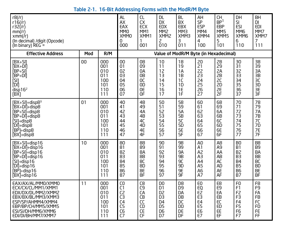

## Installation
> ### How to compile:
> 1. Navigate to the right folder with a console.
> 2. Enter :
>```bash
>make 
>```

### Usage
```bash
./assembler file_name [-options] [-h for help]
```

### Options 

> 1. -p : To print source program.
> 2. -s : To print symbol table.
> 3. -i : To print immediate code.
> 4. -t : To print literal table.
> 5. -l : To print lst of the source file.

### To use as a shell command

```bash
make
make install
```
### Usage
```bash
assembler file_name [-options] [-h for help]
```
### To view the lst file, file_name.lst is created when you pass -l
```bash
cat file_name.lst
```

---

# OP Code Table

modrm can be looked up from table below

value of immediate are in little endian format

| Operation        | Opcode           |
| ------------- |:-------------:|
| mov reg, reg     | 89 modrm | 
| mov eax, immediate      | B8 value of immediate      |
| mov ecx, immediate      | B9 value of immediate      |
| mov edx, immediate      | BA value of immediate      |
| mov ebx, immediate      | BB value of immediate      |
| mov esp, immediate      | BC value of immediate      |
| mov ebp, immediate      | BD value of immediate      |
| mov esi, immediate      | BE value of immediate      |
| mov edi, immediate      | BF value of immediate      |
| mov eax, symbol      	  | B8[address of symbol]      |
| mov ecx, symbol	  | B9[address of symbol]      |
| mov edx, symbol         | BA[address of symbol]      |
| mov ebx, symbol         | BB[address of symbol]      |
| mov esp, symbol         | BC[address of symbol]      |
| mov ebp, symbol      	  | BD[address of symbol]      |
| mov esi, symbol         | BE[address of symbol]      |
| mov edi, symbol         | BF[address of symbol]      |
| add eax, immediate     | 05 value of immediate      |
| add eax, symbol     | 05 [address of symbol]      |
| add reg, symbol     | 81modrm_with_eax [address of immediate]      |
| add reg, reg      | 01 modrm      |
| add reg, immediate     | 81modrm_with_eax [address of immediate]      |
| sub eax, immediate     | 2D value of immediate      |
| sub eax, symbol     | 2D [address of symbol]      |
| sub reg, symbol     | 83 modrm_with_eax [address of immediate]      |
| sub reg, reg      | 29 modrm      |
| sub reg, immediate     | 83modrm_with_eax [address of immediate]      |
| mul reg0     | F7E0 |
| mul reg1     | F7E1 |
| mul reg2     | F7E2 |
| mul reg3     | F7E3 |
| mul reg4     | F7E4 |
| mul reg5     | F7E5 |
| mul reg6     | F7E6 |
| mul reg7     | F7E7 |


# Modrm Table

